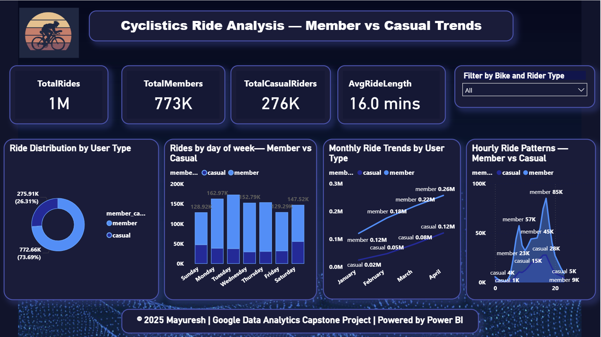

🚴‍♂️ Cyclistic Bike-Share Case Study

Google Data Analytics Capstone Project (End-to-End Analysis)

---

🧭 Project Overview

This project explores Cyclistic’s 12-month bike-share dataset to understand the behavioral differences between casual riders and annual members.
The goal is to help Cyclistic’s marketing team design strategies to convert casual riders into annual members using data-driven insights.

✅ Approach:
This project follows the Google Data Analytics framework:
Ask → Prepare → Process → Analyze → Share → Act

---

📂 Project Structure

```
cyclistic-case-study/
├─ dashboard/
│  ├─ dashboard_screenshot/ → Power BI visuals  
│  └─ cyclistic_dashboard.pbix → Interactive dashboard file  
├─ data/
│  ├─ raw/ → Original 12 CSV files  
│  └─ processed/ → Cleaned data, SQLite DB, combined dataset  
├─ scripts/ → Python scripts for ingestion & cleaning  
├─ notebook/ → Jupyter notebook + data_dictionary.md  
├─ sql/ → SQL queries and DB project files  
├─ reports/ → SQL screenshots + reports_brief.md  
└─ README.md → Documentation
```

---

🧠 Business Objective

* Identify behavioral patterns between casual and member riders
* Analyze time, day, and season-based usage
* Recommend marketing strategies for conversion

---

🧰 Tech Stack

| Area            | Tool / Language        | Purpose                      |
| --------------- | ---------------------- | ---------------------------- |
| Data Cleaning   | Python (pandas, numpy) | Merge and transform 12 CSVs  |
| Database        | SQLite                 | Store processed dataset      |
| Analysis        | SQL                    | Query and aggregate insights |
| Visualization   | Power BI               | Interactive dashboard        |
| Version Control | Git & GitHub           | Portfolio management         |

---

📊 Key Insights & Highlights

| Metric                     | Members                | Casual Riders | Change (%)               |
| -------------------------- | ---------------------- | ------------- | ------------------------ |
| Total Rides                | 773K                   | 276K          | —                        |
| Ride Share                 | 73.7%                  | 26.3%         | —                        |
| Avg Ride Length (mins)     | 12.6                   | 25.3          | +101% longer for casuals |
| Weekend Usage              | +12%                   | +63%          | Casuals dominate         |
| Peak Months (Mar–Jun)      | +42% activity increase | —             |                          |
| Hourly Peak                | 8–10 AM & 5–7 PM       | 4–6 PM        | —                        |

💡 **Observation:** Members use bikes for weekday commuting, while casual riders prefer leisure rides on weekends — a key opportunity for targeted marketing.

---

🧩 Dashboard Summary

KPIs Displayed:

* Total Rides — 1M total
* Total Members — 773K
* Total Casual Riders — 276K
* Average Ride Duration — 16.0 mins

Visual Highlights:

* 📊 Ride Distribution — Member vs Casual breakdown (73.7% vs 26.3%)
* 📅 Weekly Trends — Casuals dominate weekends; members commute on weekdays
* 📈 Monthly Trends — Growth of 42% between January → June
* 🕒 Hourly Patterns — Member peak during commute hours

📍 Dashboard built with Power BI — dynamic filters allow viewing by bike & rider type.


---

🧾 Insights & Recommendations

1. 🎯 Target casual riders with weekend discounts and loyalty programs.
2. 💼 Corporate plans for member expansion (commuters = primary audience).
3. 📱 Push notifications offering “Membership after 5 rides” incentives.

---

🧠 Learnings

* Implemented end-to-end data pipeline using Python → SQL → Power BI.
* Strengthened data visualization storytelling.
* Built automation-ready structure for future data refresh.

---

👨‍💻 Author

Mayuresh Parbat
📍 Pune, India
🎯 Data Analyst | Python | SQL | Power BI | Excel
🔗 [LinkedIn Profile](www.linkedin.com/in/mayuresh-parbat-a32b4133a)
